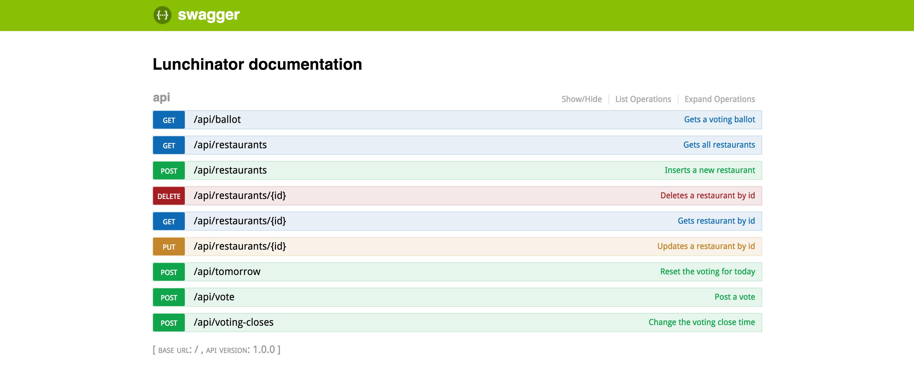

# lunchinator

This is an job interview challenge app.  I have built it to the exact specifications outlined in [these instructions](instructions/instructions.md).  

If I wasn't building to these specific specifications, then I may have built several things differently.  Because of that thought, I have tried to build this app as much "plug-in-play" modules as possible, allowing many things to be easily swapped out.  Please see [the instructions](instructions/instructions.md) file to get an idea of what this app is supposed to do.

Please view this respository as a good example of my coding skills and practices.

## To run

First, create the file `/server/modules/twitterCreds.json`, and save your own Twitter credentials here.  Then, run the command: 

```
# node version needs to be 6.1+
node -v

# Run tests
npm test

# Run server
npm start
```

You can go to your browser at [http://localhost:3000](http://localhost:3000), or ping the routes externally with the base URL: http://localhost:3000/api.

## Project structure

    server.js
      |-> Cron job
      |-> Hapi server with Swagger plugin
        | -> Creates a UI (available at: http://localhost:3000)
        | -> Initializes routes
          | -> Routes correspond to handlers

## Screenshot


-- Clint Goodman
